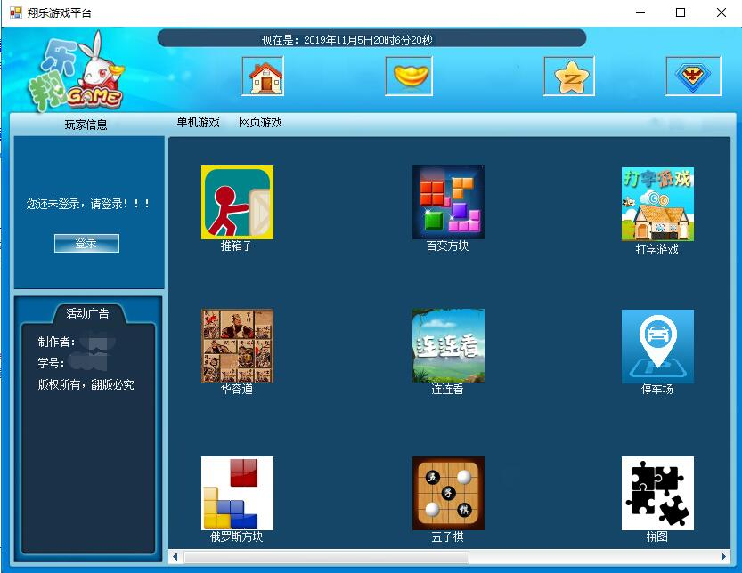

# 基于C#的游戏平台
## 简介
这是一次C#大作业，于2017年完成。在本次大作业中，我主要做了一个游戏平台，游戏平台的设计和数据库的设计都是自己设计的，而平台中的小游戏都参考了其他人的代码。游戏平台界面如下

## 使用环境
- visual studio
- Microsoft SQL

<!-- ## 开始 -->
## 目录说明
    |------database 数据库文件
    |------GamePlatform  
        |--Con_code 公共类文件
        |--Five_file 五子棋
        |--HuaRong_file 华容道
        |--Lian_Look_file 连连看
        |--Mine_weeper_file 扫雷
        |--Park_file 停车场
        |--Snake_file 贪吃蛇
        |--Sokeban_file 拼图游戏
        |--Tank_File 坦克游戏
        |--Type_file 打字游戏
        |--Variety_Of_Boxs_file 百变方块
        |--Resources 图片资源
        
  
